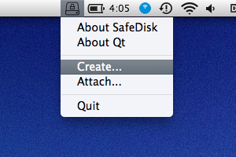
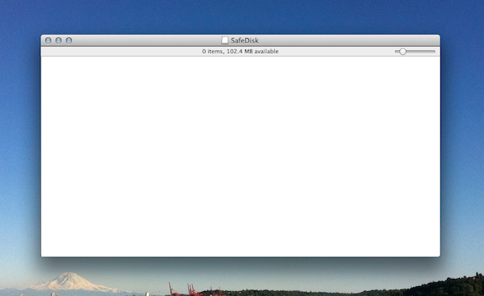

Here's another cut. I haven't rebuilt the app in a bit but I think usage instructions there should be pretty quick.

SafeDisk
========

# What is SafeDisk?

SafeDisk is safe storage for your files. It gives you a place to store your files that only you can access (safe from prying eyes) and is backed up in multiple physical locations (safe from lost/broken hardware). All copies of your data are [encrypted](#crypto) on disk and mirrored to your friends or any place you choose. Unlike cloud storage you have full control over how your data gets placed and there are no monthly fees or accounts that can expire.

The SafeDisk container is composed of files that are written in such a way as to allow them to be safely synced while in use by tools such as BitTorrent Sync, Dropbox, or rsync. Currently the authors are using BitTorrent Sync but we are investigating open source alternatives.

SafeDisk runs on Mac and Linux with Windows support planned. 

# How to get SafeDisk

For Mac OS X users with [version] or newer, we provide a package which you can download here: [TODO: Insert link] For developers and Linux users, we recommend you build from source (see [Building](#building) section). 

# How to use SafeDisk

First, install the SafeDisk application from the installer in this DMG [TODO link]. After installation launch SafeDisk from the Applications folder. This will place an icon in your status area:

Then create an image:

Because SafeDisk is effectively a disk image you'll need to set the maximum size of the volume up front. Note that the underlying storage will start out at a few megabytes and during usage may grow up to double the capacity.

...and there you go. A freshly built, empty disk has been made. It will be stored in a bundle with a .disk extension.

# How to backup to your friends using BTSync

Place the .disk bundle into a directory synced by BitTorrent Sync.

# Crypto

SafeDisk uses state of the art, vetted cryptography to protect your data from disclosure or tampering. Data at rest is encrypted with AES-256-GCM with a key derived from the user's passphrase with scrypt. It also uses a storage format that masks your usage pattern, essentially by transforming scattered writes on the protected files into a stream of encrypted data appended to the container.

For more details on the cryptography used refer to Wikipedia's articles on [AES](http://en.wikipedia.org/wiki/Advanced_Encryption_Standard) and [Galois Counter Mode](http://en.wikipedia.org/wiki/Galois/Counter_Mode). Matthew Green has a nice write-up covering some of the rationale for [selecting a cipher](http://blog.cryptographyengineering.com/2012/05/how-to-choose-authenticated-encryption.html).

# Building

## Building on Linux

[some instructions here]

### Linux build Status

## Building on OS X
1. `brew install openssl osxfuse qt5`
1. `. ./osx.env`
1. `./build package`

The result is at `out/release/SafeDisk.dmg`

Note: On OS X Yosemite, the `osxfuse` package is no longer installable via homebrew. You'll need to manually install this package on your development machine in order to build SafeDisk.

## How to use SafeDisk from the command line on OS X

### Make a 100 MB SafeDisk
`./scripts/macosx/make_safedisk ~/Documents/SafeDisk.disk 100`

SafeDisk will prompt you for a password, this will be your new disk's password.

### Mount a SafeDisk
`./scripts/macosx/mount_safedisk ~/Documents/SafeDisk.disk`

SafeDisk will again prompt you for a password.  
Presuming it's correct, the system will mount the drive
and it will appear as a mounted volume (initially called Untitled).

### Unmount a SafeDisk
Hit the eject icon for the disk.  

### Make a backup
`~/Documents/SafeDisk.disk/data` contains all of the actual data, rsync at will.